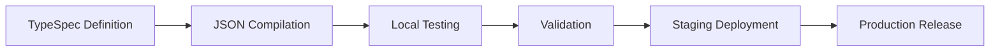

# Microsoft 365 Declarative Agents Development Guidelines

## Overview

Microsoft 365 Copilot declarative agents are powerful custom AI assistants that extend Microsoft 365 Copilot with specialized capabilities, enterprise data access, and custom behaviors. These guidelines provide comprehensive development practices for creating production-ready agents using the latest v1.5 JSON schema specification with full Microsoft 365 Agents Toolkit integration.

## Schema Specification v1.5

### Core Properties

```json
{
  "$schema": "https://developer.microsoft.com/json-schemas/copilot/declarative-agent/v1.5/schema.json",
  "version": "v1.5",
  "name": "string (max 100 characters)",
  "description": "string (max 1000 characters)", 
  "instructions": "string (max 8000 characters)",
  "capabilities": ["array (max 5 items)"],
  "conversation_starters": ["array (max 4 items, optional)"]
}
```

### Character Limits & Constraints
- **Name**: Maximum 100 characters, required
- **Description**: Maximum 1000 characters, required  
- **Instructions**: Maximum 8000 characters, required
- **Capabilities**: Maximum 5 items, minimum 1 item
- **Conversation Starters**: Maximum 4 items, optional

## Available Capabilities

### Core Capabilities
1. **WebSearch**: Internet search and real-time information access
2. **OneDriveAndSharePoint**: File access, document search, content management
3. **GraphConnectors**: Enterprise data integration from third-party systems
4. **MicrosoftGraph**: Access to Microsoft 365 services and data

### Communication & Collaboration
5. **TeamsAndOutlook**: Teams chat, meetings, email integration
6. **CopilotForMicrosoft365**: Advanced Copilot features and workflows

### Business Applications
7. **PowerPlatform**: Power Apps, Power Automate, Power BI integration
8. **BusinessDataProcessing**: Advanced data analysis and processing
9. **WordAndExcel**: Document creation, editing, analysis
10. **EnterpriseApplications**: Third-party business system integration
11. **CustomConnectors**: Custom API and service integrations

## Microsoft 365 Agents Toolkit Integration

### VS Code Extension Setup
```bash
# Install Microsoft 365 Agents Toolkit
# Extension ID: teamsdevapp.ms-teams-vscode-extension
```

### TypeSpec Development Workflow

#### 1. Modern Agent Definition
```typespec
import "@typespec/json-schema";

using TypeSpec.JsonSchema;

@jsonSchema("/schemas/declarative-agent/v1.5/schema.json")
namespace DeclarativeAgent;

/** Microsoft 365 Declarative Agent */
model Agent {
  /** Schema version */
  @minLength(1)
  $schema: "https://developer.microsoft.com/json-schemas/copilot/declarative-agent/v1.5/schema.json";
  
  /** Agent version */
  version: "v1.5";
  
  /** Agent name (max 100 characters) */
  @maxLength(100)
  @minLength(1)
  name: string;
  
  /** Agent description (max 1000 characters) */
  @maxLength(1000)
  @minLength(1)  
  description: string;
  
  /** Agent instructions (max 8000 characters) */
  @maxLength(8000)
  @minLength(1)
  instructions: string;
  
  /** Agent capabilities (1-5 items) */
  @minItems(1)
  @maxItems(5)
  capabilities: AgentCapability[];
  
  /** Conversation starters (max 4 items) */
  @maxItems(4)
  conversation_starters?: ConversationStarter[];
}

/** Available agent capabilities */
union AgentCapability {
  "WebSearch",
  "OneDriveAndSharePoint", 
  "GraphConnectors",
  "MicrosoftGraph",
  "TeamsAndOutlook",
  "PowerPlatform",
  "BusinessDataProcessing",
  "WordAndExcel",
  "CopilotForMicrosoft365",
  "EnterpriseApplications",
  "CustomConnectors"
}

/** Conversation starter definition */
model ConversationStarter {
  /** Starter text (max 100 characters) */
  @maxLength(100)
  @minLength(1)
  text: string;
}
```

#### 2. Compilation to JSON
```bash
# Compile TypeSpec to JSON manifest
tsp compile agent.tsp --emit=@typespec/json-schema
```

### Environment Configuration

#### Development Environment
```json
{
  "name": "${DEV_AGENT_NAME}",
  "description": "Development version: ${AGENT_DESCRIPTION}",
  "instructions": "${AGENT_INSTRUCTIONS}",
  "capabilities": ["${REQUIRED_CAPABILITIES}"]
}
```

#### Production Environment
```json
{
  "name": "${PROD_AGENT_NAME}",
  "description": "${AGENT_DESCRIPTION}",
  "instructions": "${AGENT_INSTRUCTIONS}",
  "capabilities": ["${PRODUCTION_CAPABILITIES}"]
}
```

## Development Best Practices

### 1. Schema Validation
```typescript
// Validate against v1.5 schema
const schema = await fetch('https://developer.microsoft.com/json-schemas/copilot/declarative-agent/v1.5/schema.json');
const validator = new JSONSchema(schema);
const isValid = validator.validate(agentManifest);
```

### 2. Character Limit Management
```typescript
// Validation helper functions
function validateName(name: string): boolean {
  return name.length > 0 && name.length <= 100;
}

function validateDescription(description: string): boolean {
  return description.length > 0 && description.length <= 1000;
}

function validateInstructions(instructions: string): boolean {
  return instructions.length > 0 && instructions.length <= 8000;
}
```

### 3. Capability Selection Strategy
- **Start Simple**: Begin with 1-2 core capabilities
- **Incremental Addition**: Add capabilities based on user feedback
- **Performance Testing**: Test each capability combination thoroughly
- **Enterprise Readiness**: Consider compliance and security implications

## Agents Playground Testing

### Local Testing Setup
```bash
# Start Agents Playground
npm install -g @microsoft/agents-playground
agents-playground start --manifest=./agent.json
```

### Testing Scenarios
1. **Capability Validation**: Test each declared capability
2. **Conversation Flow**: Validate conversation starters
3. **Error Handling**: Test invalid inputs and edge cases
4. **Performance**: Measure response times and reliability

## Deployment & Lifecycle Management

### 1. Development Lifecycle


### 2. Version Management
```json
{
  "name": "MyAgent v1.2.0",
  "description": "Production agent with enhanced capabilities",
  "version": "v1.5",
  "metadata": {
    "version": "1.2.0",
    "build": "20241208.1",
    "environment": "production"
  }
}
```

### 3. Environment Promotion
- **Development**: Full debugging, verbose logging
- **Staging**: Production-like testing, performance monitoring  
- **Production**: Optimized performance, minimal logging

## Advanced Features

### Behavior Overrides
```json
{
  "instructions": "You are a specialized financial analyst agent. Always provide disclaimers for financial advice.",
  "behavior_overrides": {
    "response_tone": "professional",
    "max_response_length": 2000,
    "citation_requirements": true
  }
}
```

### Localization Support
```json
{
  "name": {
    "en-US": "Financial Assistant",
    "es-ES": "Asistente Financiero",
    "fr-FR": "Assistant Financier"
  },
  "description": {
    "en-US": "Provides financial analysis and insights",
    "es-ES": "Proporciona análisis e insights financieros",
    "fr-FR": "Fournit des analyses et insights financiers"
  }
}
```

## Monitoring & Analytics

### Performance Metrics
- Response time per capability
- User engagement with conversation starters
- Error rates and failure patterns
- Capability utilization statistics

### Logging Strategy
```typescript
// Structured logging for agent interactions
const log = {
  timestamp: new Date().toISOString(),
  agentName: "MyAgent",
  version: "1.2.0",
  userId: "user123",
  capability: "WebSearch",
  responseTime: 1250,
  success: true
};
```

## Security & Compliance

### Data Privacy
- Implement proper data handling for sensitive information
- Ensure compliance with GDPR, CCPA, and organizational policies
- Use appropriate access controls for enterprise capabilities

### Security Considerations  
- Validate all inputs and outputs
- Implement rate limiting and abuse prevention
- Monitor for suspicious activity patterns
- Regular security audits and updates

## Troubleshooting

### Common Issues
1. **Schema Validation Errors**: Check character limits and required fields
2. **Capability Conflicts**: Verify capability combinations are supported
3. **Performance Issues**: Monitor response times and optimize instructions
4. **Deployment Failures**: Validate environment configuration and permissions

### Debug Tools
- TypeSpec compiler diagnostics
- Agents Playground debugging
- Microsoft 365 Agents Toolkit logs
- Schema validation utilities

This comprehensive guide ensures robust, scalable, and maintainable Microsoft 365 Copilot declarative agents with full TypeSpec and Microsoft 365 Agents Toolkit integration.