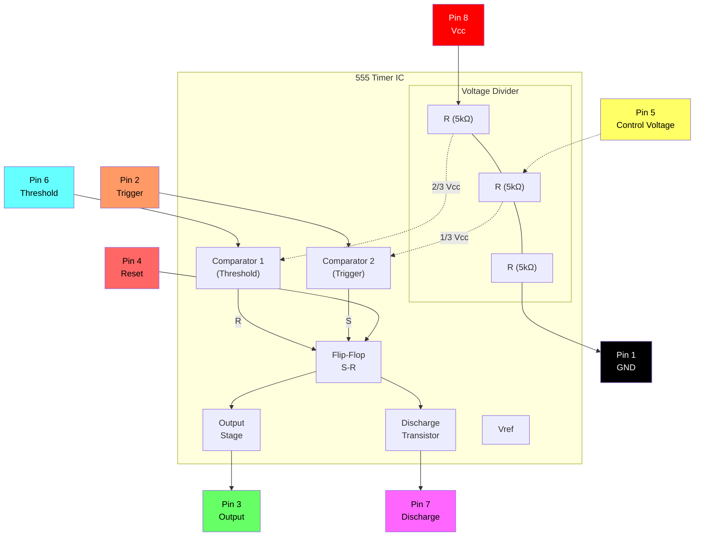
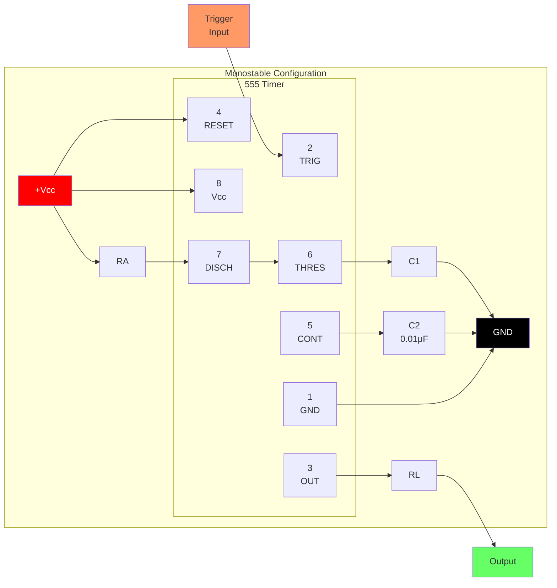
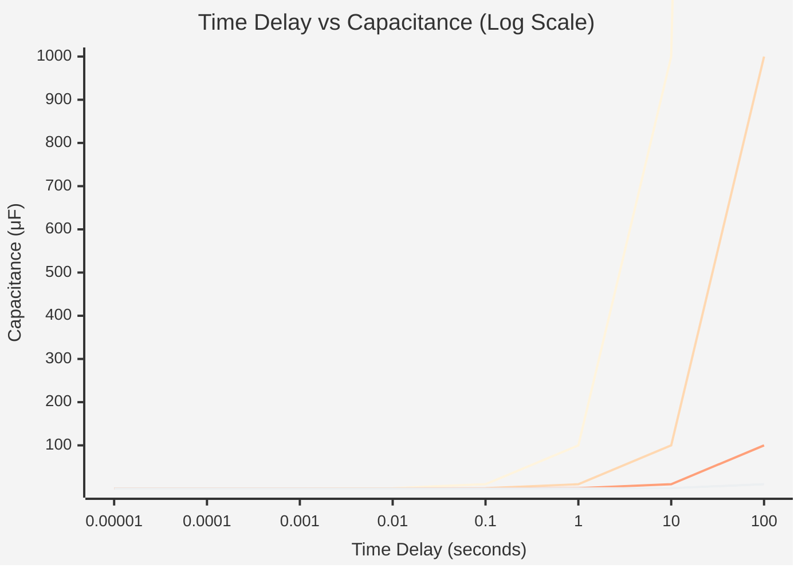
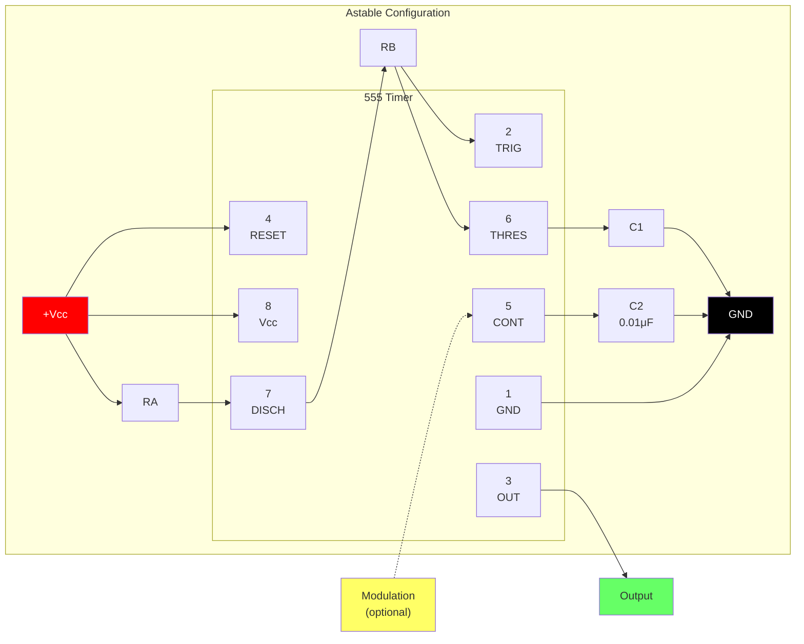
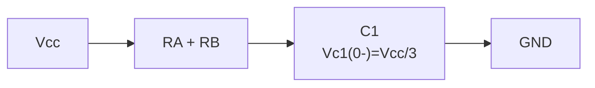
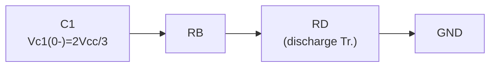
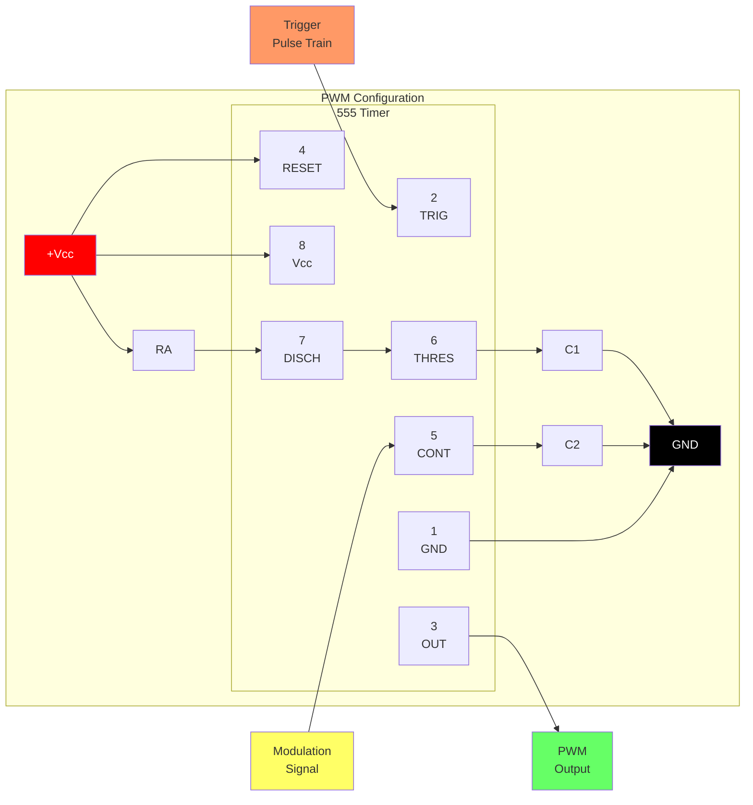
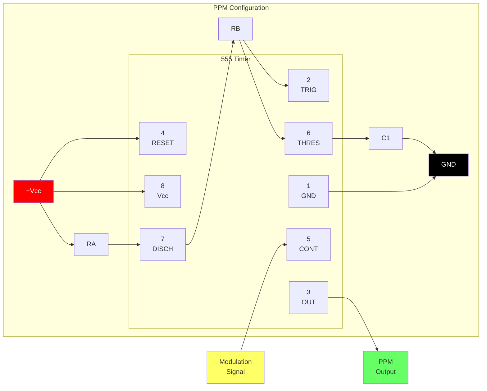
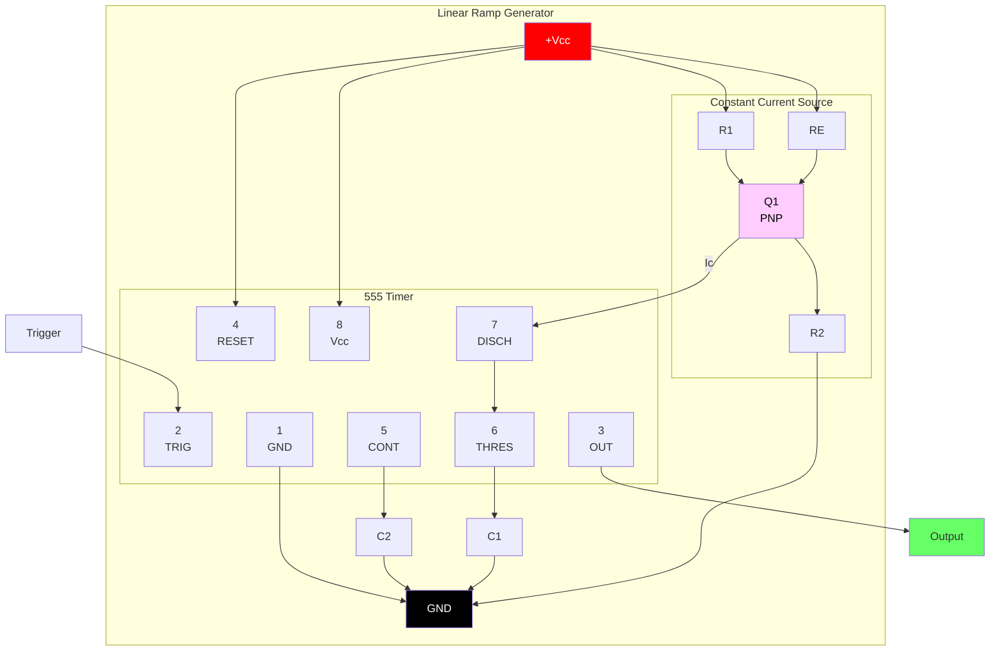

# 555

[www.fairchildsemi.com](www.fairchildsemi.com)

The LM555/NE555/SA555 is  a highly stable controller capable of producing accurate timing pulses. With a monostable operation, the time delay is controlled by one external resistor and one capacitor. With an astable operation, the frequency and duty cycle are accurately controlled by two external resistors and one capacitor.

## Features

- High Current Drive Capability (200mA)
- Adjustable Duty Cycle
- Temperature Stability of 0.005%/°C
- Timing From μSec to Hours
- Turn off Time Less Than 2μSec

## Applications

- Precision Timing
- Pulse Generation
- Time Delay Generation
- Sequential Timing

## Internal Block Diagram



**Pin Configuration:**

| Pin | Name | Function |
|:---:|:---|:---|
| 1 | GND | Ground reference |
| 2 | TRIG | Trigger input (< 1/3 Vcc starts timing) |
| 3 | OUT | Output (high or low) |
| 4 | RESET | Active low reset |
| 5 | CONT | Control voltage (2/3 Vcc reference) |
| 6 | THRES | Threshold input (> 2/3 Vcc ends timing) |
| 7 | DISCH | Discharge (open collector) |
| 8 | Vcc | Supply voltage (+4.5V to +16V) |

## Absolute Maximum Ratings (Ta = 25°C)

| Parameter | Symbol | Value | Unit |
| :--- | :--- | :--- | :--- |
| Supply Voltage | Vcc | 16 | V |
| Lead temperature (soldering 10 sec) | Tled | 300 | °C |
| Power Dissipation | PD | 600 | mW |
| Operating Temperature Range<br>LM555/NE555<br>SA555 | Topr | - 65 ~ + 150 | °C |

## Electrical Characteristics

(TA = 250C, vcc = 5 15V, unless otherwise specified)

| Parameter | Symbol | Conditions | Min. | Typ. | Max. | Unit |
| :--- | :--- | :--- | :--- |:--- | :--- | :--- |
| Supply Voltage | vcc | - | 4.5 | - | 16 | V |
| Supply Current (Low Stable) (Note 1) | Icc | Vcc = 5V, Rl = ∞<hr>Vcc = 15V, Rl = ∞ | -<hr>- | 3<hr>7.5 | 6<hr>15 | mA<hr>mA |
| Timing Error (Monostable)<br>Initial Accuracy (Note2)<br>Drift with Temperature (Note4)<br>Drift with Supply Voltage (Note4)<br> | ACCUR<br>Δt/ΔT<br>Δt/ΔVcc | Ra = 1kΩ to100kΩ<br>C = 0.1μF | - | 1.0<br>50<br>0.1 | 3.0<br><br>0.5 | %<br>ppm/°C<br>%/V |
| Timing Error (Astable)<br>Initial Accuracy (Note2)<br>Drift with Temperature (Note4)<br>Drift with Supply Voltage (Note4) | ACCUR<br>Δt/ΔT<br>Δt/ΔVcc | Ra = 1kΩ to 100kΩ<br> C = 0.1μF | - | 2.25<br>150<br>0.3 | - | %<br>ppm/°C<br>%/V |
| Control Voltage | Vc | Vcc = 15V<hr> Vcc = 5V | 9.0<hr>2.6 | 10.0<hr>3.33 | 11.0<hr>4.0 | V<hr>V |
| Threshold Voltage | VTH | VCC = 15V<hr>VCC = 5V | -<hr>- | 10.0<hr>3.33 | -<hr>- | V<hr>V |
| Threshold Current (Note3) | Ith | - | - | 0.1 | 0.25 | μA |
| Trigger Voltage | VTR | VCC = 5V<hr>VCC = 15V | 1.1<hr>4.5 | 1.67<hr>5 | 2.2<hr>5.6 | V<hr>V |
| Trigger Current | ITR | VTR = 0V | 0.01 | 2.0 | μA |
| Reset Voltage | VRST | - | 0.4 | 0.7 | 1.0 | V |
| Reset Current | IRST | - | 0.1 | 0.4 | mA |
| Low Output Voltage | VOL | VCC = 15V<br>ISINK = 10mA<br>ISINK = 50mA<hr>VCC = 5V<br>ISINK = 5mA | -<hr>- | 0.06<br>0.3<hr>0.05 | 0.25<br>0.75<hr>0.35 | V<br>V<hr>V |
| High Output Voltage | VOH | VCC = 15V<br>ISOURCE = 200mA<br>ISOURCE = 100mA<hr>VCC = 5V<br>ISOURCE = 100mA | 12.75<hr>2.75 | 12.5<br>13.3<hr>3.3 | -<hr>- | V<br>V<hr>V |
| Rise Time of Output (Note4) | tR | - | - | 100 | - | ns |
| Fall Time of Output (Note4) | tF | - | - | 100 | - | ns |
| Discharge Leakage Current | ILKG | - | - | 20 | 100 | nA |

**Notes:**

1. When the output is high. the supply current is typically 1mA less than at VCC = 5V.
2. Tested at VCC = 5.0V and VCC = 15V.
3. This will determine the maximum value of RA + RB for 15V operation, the max- total R = 20MQ. and for 5V operation, the max/
   - total R 8.7MΩ
4. These parameters, although guaranteed. are not 100% tested in production.

## Application Information

Table 1 below is the basic operating table of 555 timer:

| Threshold Voltage<br>(Vth)(PIN 6) | Trigger Voltage<br>(Vtr)(PIN 2) | Reset(PIN 4) | Output(PIN 3) | Discharging Tr.<br>(PIN 7) |
| :--- | :--- | :--- | :--- | :--- |
| Don't care | Don't care | Low | Low | ON |
| Vth > 2Vcc / 3 | Vth > 2Vcc / 3 | High | Low | ON |
| Vcc / 3 < Vth < 2 Vcc / 3 | Vcc / 3 < Vth < 2 Vcc / 3 | High | - | - |
| Vth < Vcc / 3 | Vth < Vcc / 3 | High | High | OFF |

When the low signal input is applied to the reset terminal, the timer output remains low regardless of the threshold voltage or the trigger voltage. Only when the high signal is applied to the reset terminal, the timer's output changes according to threshold voltage and trigger voltage. When the threshold voltage exceeds 2/3 of the supply voltage while the timer output is high, the timer's internal discharge Tr. turns on, lowering the threshold voltage to below 1/3 of the supply voltage. During this time, the timer output is maintained low. Later, if a low signal is applied to the trigger voltage so that it becomes 1/3 of the supply voltage, the timer's internal discharge Tr. turns off, increasing the threshold voltage and driving the timer output again at high.

### 1. Monostable Operation

#### Figure 1. Monostable Circuit



**Component Values:**

- RA: Timing resistor (1kΩ to 10MΩ typical)
- C1: Timing capacitor
- C2: Bypass capacitor (0.01μF recommended)
- RL: Load resistor

**Time Delay Formula:**
$$t_d = 1.1 \times R_A \times C_1$$

#### Figure 2. Resistance and Capacitance vs. Time Delay (td)



| RA | C1 | Time Delay (td) |
|:---|:---|:---|
| 1 kΩ | 0.1 μF | 110 μs |
| 10 kΩ | 0.1 μF | 1.1 ms |
| 100 kΩ | 0.1 μF | 11 ms |
| 1 MΩ | 1 μF | 1.1 s |
| 10 MΩ | 10 μF | 110 s |

#### Figure 3. Waveforms of Monostable Operation

```mermaid
%%{init: {'theme': 'base'}}%%
gantt
    title Monostable Waveforms (Normal Operation)
    dateFormat X
    axisFormat %s
    
    section Trigger
    High (Vcc)    :a1, 0, 2
    Low (<Vcc/3)  :crit, a2, 2, 3
    High (Vcc)    :a3, 3, 10
    
    section Output
    Low (0V)      :b1, 0, 2
    High (Vcc)    :active, b2, 2, 8
    Low (0V)      :b3, 8, 10
    
    section Threshold (Vc1)
    Charging      :c1, 2, 8
```



```
    Trigger ─────┐     ┌─────────────────────
    (Pin 2)      └─────┘  
                    ↓ Trigger pulse
                    
    Output  ─────────┐          ┌───────────
    (Pin 3)         └──────────┘
                    |←── td ───→|
                    
    Threshold        /‾‾‾‾‾‾‾‾\
    (Pin 6)    ─────/          \────────────
               0V  ↗            ↘  
                  Vcc/3      2Vcc/3
                  
    td = 1.1 × RA × C1
```

Figure 1 illustrates a monostable circuit. In this mode, the timer generates a fixed pulse whenever the trigger voltage falls below Vcc/3. When the trigger pulse voltage applied to the #2 pin falls below Vcc/3 while the timer output is low, the timer's internal flip-flop turns the discharging Tr. off and causes the timer output to become high by charging the external capacitor C1 and setting the flip-flop output at the same time. The voltage across the external capacitor C1, VC1 increases exponentially with the time constant t=RA*C and reaches 2Vcc/3 at td=1.1RA*C. Hence, capacitor C1 is charged through resistor RA. The greater the time constant RAC, the longer it takes for the VC1 to reach 2Vcc/3. In other words, the time constant RAC controls the output pulse width. When the applied voltage to the capacitor C1 reaches 2Vcc/3, the comparator on the trigger terminal resets the flip-flop, turning the discharging Tr. on. At this time, C1 begins to discharge and the timer output converts to low. In this way, the timer operating in the monostable repeats the above process. Figure 2 shows the time constant relationship based on RA and C. Figure 3 shows the general waveforms during the monostable operation. It must be noted that, for a normal operation, the trigger pulse voltage needs to maintain a minimum of Vcc/3 before the timer output turns low. That is, although the output remains unaffected even if a different trigger pulse is applied while the output is high, it may be affected and the waveform does not operate properly if the trigger pulse voltage at the end of the output pulse remains at below Vcc/3. Figure 4 shows such a timer output abnormality.

#### Figure 4. Waveforms of Monostable Operation (abnormal)

```
    Trigger ─────┐  ┌──┐  ┌─────────────────
    (Pin 2)      └──┘  └──┘  
                 ↓     ↓ Retriggering during output high
                    
    Output  ─────────┐                ┌─────
    (Pin 3)         └────────────────┘
                    |←── extended td ──→|
                    
    Threshold        /‾‾‾‾‾‾‾‾‾‾‾‾‾‾‾‾\
    (Pin 6)    ─────/                  \────
               0V  ↗                    ↘  
                  Vcc/3              2Vcc/3

    ⚠️ ABNORMAL: Trigger held low extends output pulse!
    Trigger must return high before output goes low.
```

**Note:** For normal operation, the trigger pulse voltage must return above Vcc/3 before the timer output goes low. If the trigger remains below Vcc/3, the output pulse will be extended abnormally.

### 2. Astable Operation

#### Figure 5. Astable Circuit



**Component Values:**

- RA: Charge resistor (controls HIGH time)
- RB: Charge/discharge resistor (affects both HIGH and LOW times)  
- C1: Timing capacitor
- C2: Bypass capacitor (0.01μF recommended)

**Timing Formulas:**

- High time: $t_H = 0.693 \times (R_A + R_B) \times C_1$
- Low time: $t_L = 0.693 \times R_B \times C_1$
- Period: $T = t_H + t_L = 0.693 \times (R_A + 2R_B) \times C_1$
- Frequency: $f = \frac{1.44}{(R_A + 2R_B) \times C_1}$
- Duty Cycle: $D = \frac{R_A + R_B}{R_A + 2R_B}$

#### Figure 6. Capacitance and Resistance vs. Frequency

```mermaid
%%{init: {'theme': 'base'}}%%
xychart-beta
    title "Free Running Frequency vs Capacitance"
    x-axis "Frequency (Hz)" [0.1, 1, 10, 100, 1000, 10000, 100000]
    y-axis "Capacitance (μF)" 0.001 --> 100
```

| (RA + 2RB) | C1 | Frequency |
|:---|:---|:---|
| 1.44 kΩ | 1 μF | 1 kHz |
| 14.4 kΩ | 1 μF | 100 Hz |
| 144 kΩ | 1 μF | 10 Hz |
| 14.4 kΩ | 0.1 μF | 1 kHz |
| 14.4 kΩ | 0.01 μF | 10 kHz |

#### Figure 7. Waveforms of Astable Operation

```
    Output  ────┐     ┌─────┐     ┌─────┐     ┌────
    (Pin 3)    └─────┘     └─────┘     └─────┘
               |←tL→|←─tH─→|←tL→|←─tH─→|
               
    Threshold       /\        /\        /\
    (Pin 6)   ─────/  \──────/  \──────/  \──────
              Vcc/3    2Vcc/3
              
              ├────── T ──────┤
              T = tH + tL = 0.693(RA + 2RB)C1
              
    Charging:   C1 charges through RA + RB
    Discharging: C1 discharges through RB only
```

**Typical Values:** RA = 1kΩ, RB = 1kΩ, C1 = 1μF, Vcc = 5V

An astable timer operation is achieved by adding resistor RB to Figure 1 and configuring as shown on Figure 5. In the astable operation, the trigger terminal and the threshold terminal are connected so that a self-trigger is formed, operating as a multi vibrator. When the timer output is high, its internal discharging Tr. turns off and the VC1 increases by exponential function with the time constant (RA+RB)*C. When the VC1, or the threshold voltage, reaches 2Vcc/3, the comparator output on the trigger terminal becomes high, resetting the F/F and causing the timer output to become low. This in turn turns on the discharging Tr. and the C1 discharges through the discharging channel formed by RB and the discharging Tr. When the VC1 falls below Vcc/3, the comparator output on the trigger terminal becomes high and the timer output becomes high again. The discharging Tr. turns off and the VC1 rises again. In the above process, the section where the timer output is high is the time it takes for the VC1 to rise from Vcc/3 to 2Vcc/3, and the section where the timer output is low is the time it takes for the VC1 to drop from 2Vcc/3 to Vcc/3. When timer output is high, the equivalent circuit for charging capacitor C1 is as follows:

#### Equation 1: Charging Circuit Equivalent



**Charging Equation:**
$$C_1 \frac{dV_{C1}}{dt} = \frac{V_{CC} - V_{(0-)}}{R_A + R_B} \quad (1)$$

$$V_{C1}(0^+) = \frac{V_{CC}}{3} \quad (2)$$

$$V_{C1}(t) = V_{CC} \left[ 1 - \frac{2}{3} e^{-\frac{t}{(R_A + R_B)C_1}} \right] \quad (3)$$

Since the duration of the timer output high state (tH) is the amount of time it takes for the VC1(t) to reach 2Vcc/3,

#### Equation 2: High Time Calculation

$$\frac{2}{3}V_{CC} = V_{CC} \left[ 1 - \frac{2}{3} e^{-\frac{t_H}{(R_A + R_B)C_1}} \right] \quad (4)$$

$$t_H = C_1(R_A + R_B) \ln 2 = 0.693(R_A + R_B)C_1 \quad (5)$$

The equivalent circuit for discharging capacitor C1, when timer output is low is, as follows:

#### Equation 3: Discharging Circuit Equivalent



**Discharging Equation:**
$$C_1 \frac{dV_{C1}}{dt} + \frac{1}{R_A + R_B} V_{C1} = 0 \quad (6)$$

$$V_{C1}(t) = \frac{2}{3} V_{CC} e^{-\frac{t}{(R_A + R_B)C_1}} \quad (7)$$

Since the duration of the timer output low state (tL) is the amount of time it takes for the VC1(t) to reach Vcc/3,

#### Equation 4: Low Time Calculation

$$\frac{1}{3}V_{CC} = \frac{2}{3}V_{CC} e^{-\frac{t_L}{(R_B + R_D)C_1}} \quad (8)$$

$$t_L = C_1(R_B + R_D) \ln 2 = 0.693(R_A + R_B)C_1 \quad (9)$$

Since RD is normally RB>>RD although related to the size of discharging Tr., tL=0.693RBC1 (10)
Consequently, if the timer operates in astable, the period is the same with 'T=tH+tL=0.693(RA+RB)C1+0.693RBC1=0.693(RA+2RB)C1' because the period is the sum of the charge time and discharge time. And since frequency is the reciprocal of the period, the following applies.

#### Equation 5: Frequency Formula

$$f = \frac{1}{T} = \frac{1.44}{(R_A + 2R_B)C_1} \quad (11)$$

### 3. Frequency divider

By adjusting the length of the timing cycle, the basic circuit of Figure 1 can be made to operate as a frequency divider. Figure
8. illustrates a divide-by-three circuit that makes use of the fact that retriggering cannot occur during the timing cycle.

#### Figure 8. Waveforms of Frequency Divider Operation

```
    Trigger ─┐ ┌─┐ ┌─┐ ┌─┐ ┌─┐ ┌─┐ ┌─┐ ┌─┐ ┌─┐ ┌─┐ ┌─
    (Input)  └─┘ └─┘ └─┘ └─┘ └─┘ └─┘ └─┘ └─┘ └─┘ └─┘
             1   2   3   1   2   3   1   2   3
             
    Output  ─┐        ┌──┐        ┌──┐        ┌──────
    (÷3)     └────────┘  └────────┘  └────────┘
             |← skip →|  |← skip →|  |← skip →|
                2,3          2,3         2,3
                
    Threshold      /‾‾‾‾\        /‾‾‾‾\        /‾‾‾‾\
    (Vc1)    ─────/      \──────/      \──────/
             
    RA = 9.1kΩ, RB = 1kΩ, C1 = 0.01μF, Vcc = 5V
    
    ⚙️ Divide-by-N: Set timing so output ignores (N-1) trigger pulses
```

### 4. Pulse Width Modulation

The timer output waveform may be changed by modulating the control voltage applied to the timer's pin 5 and changing the reference of the timer's internal comparators. Figure 9 illustrates the pulse width modulation circuit. When the continuous trigger pulse train is applied in the monostable mode, the timer output width is modulated according to the signal applied to the control terminal. Sine wave as well as other waveforms may be applied as a signal to the control terminal. Figure 10 shows the example of pulse width modulation waveform.

#### Figure 9. Circuit for Pulse Width Modulation



#### Figure 10. Waveforms of Pulse Width Modulation

```
    Control  ╭──────╮      ╭──────╮      ╭──────╮
    (Pin 5)  │      │      │      │      │      │
          ───╯      ╰──────╯      ╰──────╯      ╰───
             |← Modulation Signal (e.g., Sine) →|
                    
    Trigger ─┐ ┌─┐ ┌─┐ ┌─┐ ┌─┐ ┌─┐ ┌─┐ ┌─┐ ┌─┐ ┌─┐
             └─┘ └─┘ └─┘ └─┘ └─┘ └─┘ └─┘ └─┘ └─┘ └─┘
             
    Output  ─┐  ┌─┐   ┌───┐   ┌─┐  ┌─┐   ┌───┐   ┌─
    (PWM)    └──┘ └───┘   └───┘ └──┘ └───┘   └───┘
             |←w1→|←w2─→|←w3──→|
             
    Pulse width varies with control voltage:
    - Higher control voltage → Longer pulse width
    - Lower control voltage → Shorter pulse width
    
    RA = 3.9kΩ, RB = 1kΩ, RL = 1kΩ, C1 = 0.01μF, Vcc = 5V
```

### 5. Pulse Position Modulation

If the modulating signal is applied to the control terminal while the timer is connected for the astable operation as in Figure 11, the timer becomes a pulse position modulator. In the pulse position modulator, the reference of the timer's internal comparators is modulated which in turn modulates the timer output according to the modulation signal applied to the control terminal. Figure 12 illustrates a sine wave for modulation signal and the resulting output pulse position modulation : however, any wave shape could be used.

#### Figure 11. Circuit for Pulse Position Modulation



#### Figure 12. Waveforms of Pulse Position Modulation

```
    Control  ╭────────────╮          ╭────────────╮
    (Pin 5)  │            │          │            │
          ───╯            ╰──────────╯            ╰───
                Modulation Signal (Sine Wave)
                    
    Threshold     /\    /\      /\      /\    /\
    (Pin 6)  ────/  \──/  \────/  \────/  \──/  \────
                        
    Output  ─┐ ┌─┐  ┌──┐    ┌────┐    ┌──┐  ┌─┐ ┌─
    (PPM)    └─┘ └──┘  └────┘    └────┘  └──┘ └─┘
             |←t1→|←t2─→|←─t3──→|←t4─→|←t5→|
             
    Pulse spacing varies with control voltage:
    - Higher control voltage → Longer period
    - Lower control voltage → Shorter period
    
    RA = 1kΩ, RB = 1kΩ, C1 = 1nF, Vcc = 5V
```

### 6. Linear Ramp

When the pull-up resistor RA in the monostable circuit shown in Figure 1 is replaced with constant current source, the VC1 increases linearly, generating a linear ramp. Figure 13 shows the linear ramp generating circuit and Figure 14 illustrates the generated linear ramp waveforms.

#### Figure 13. Circuit for Linear Ramp



#### Figure 14. Waveforms of Linear Ramp

```
    Trigger ─────┐     ┌───────────────────────────
    (Pin 2)      └─────┘  
                    ↓ Trigger pulse
                    
    Output  ─────────┐              ┌───────────────
    (Pin 3)         └──────────────┘
                    |←──── td ────→|
                    
    Threshold        ╱              Linear ramp (not exponential)
    (Pin 6)    ─────╱               
               0V  ↗                 
                  Vcc/3           2Vcc/3
                  
    Linear ramp: Vc1 = (Ic/C1) × t
    Slope S = Ic/C1
    
    R1 = 47kΩ, R2 = 100kΩ, RE = 2.7kΩ, RL = 1kΩ, C1 = 0.01μF, Vcc = 5V
```

In Figure 13, current source is created by PNP transistor Q1 and resistor R1, R2, and RE.

#### Equation 6: Current Source Calculation

$$I_C = \frac{V_{CC} - V_E}{R_E} \quad (12)$$

Here, VE is:

$$V_E = V_{BE} + \frac{R_2}{R_1 + R_2} V_{CC} \quad (13)$$

For example, if Vcc=15V, RE=20kΩ, R1=5kW, R2=10kΩ, and VBE=0.7V, VE=0.7V+10V=10.7V Ic=(15-10.7)/20k=0.215mA

When the trigger starts in a timer configured as shown in Figure 13, the current flowing through capacitor C1 becomes a constant current generated by PNP transistor and resistors. Hence, the VC is a linear ramp function as shown in Figure 14. The gradient S of the linear ramp function is defined as follows:

#### Equation 7: Ramp Slope

$$S = \frac{V_{P-P}}{T} \quad (14)$$

Here the Vp-p is the peak-to-peak voltage. If the electric charge amount accumulated in the capacitor is divided by the capacitance, the VC comes out as follows:

```
V = Q/C (15)
```

The above equation divided on both sides by T gives us

#### Equation 8: Simplified Ramp Slope

$$\frac{V}{T} = \frac{Q/T}{C} \quad (16)$$

and may be simplified into the following equation.

```
S = I/C (17)
```

In other words, the gradient of the linear ramp function appearing across the capacitor can be obtained by using the constant current flowing through the capacitor. If the constant current flow through the capacitor is 0.215mA and the capacitance is 0.02μF, the gradient of the ramp function at both ends of the capacitor is S = 0.215m/0.022μ = 9.77V/ms.

# Mechanical Dimensions

## Package

### 8-DIP (Dual In-line Package)

```
    ┌─────────────────────────────────────┐
    │  ●                                  │
    │  #1                             #8  │
    │  ┌──┐                         ┌──┐  │
    │  │  │                         │  │  │
    │  └──┘                         └──┘  │
    │  #2                             #7  │
    │  ┌──┐       555 TIMER         ┌──┐  │
    │  │  │                         │  │  │
    │  └──┘                         └──┘  │
    │  #3                             #6  │
    │  ┌──┐                         ┌──┐  │
    │  │  │                         │  │  │
    │  └──┘                         └──┘  │
    │  #4                             #5  │
    │  ┌──┐                         ┌──┐  │
    │  │  │                         │  │  │
    │  └──┘                         └──┘  │
    └─────────────────────────────────────┘
```

**8-DIP Dimensions (in millimeters):**

| Parameter | Min | Nom | Max |
|:---|:---:|:---:|:---:|
| Package Length | - | 9.60 | - |
| Package Width | 6.20 | 6.40 | 6.60 |
| Package Height | - | 5.08 | - |
| Lead Pitch | - | 2.54 | - |
| Lead Width | 0.36 | 0.46 | 0.56 |
| Lead Thickness | - | 0.33 | - |
| Lead Length | 2.92 | 3.30 | 3.68 |
| Standoff | 0.51 | - | - |

```
              6.40 ± 0.20
         ┌────────────────┐
         │                │
    ┌────┤                ├────┐
    │    │                │    │  9.60
    │    │                │    │  MAX
    │    │                │    │
    └────┤                ├────┘
         │                │
         └────────────────┘
              ↕ 2.54 (pin pitch)
         
    Side View:
         ┌────────────────┐
    5.08 │                │
    MAX  └──┬──┬──┬──┬──┬─┘
            │  │  │  │  │   3.30 ± 0.30
            │  │  │  │  │   (lead length)
         ═══╧══╧══╧══╧══╧═══
                ↕ 0.33 MIN
```

### 8-SOP (Small Outline Package)

```
    ┌───────────────────────────────┐
    │  ●                            │
    │  #1                       #8  │
    │  ─┐                       ┌─  │
    │   │                       │   │
    ├───┴───────────────────────┴───┤
    │           555 TIMER           │
    ├───┬───────────────────────┬───┤
    │   │                       │   │
    │  ─┘                       └─  │
    │  #4                       #5  │
    └───────────────────────────────┘
```

**8-SOP Dimensions (in millimeters):**

| Parameter | Min | Nom | Max |
|:---|:---:|:---:|:---:|
| Package Length | 4.72 | 4.92 | 5.12 |
| Package Width | 5.70 | 6.00 | 6.30 |
| Package Height | - | 1.55 | 1.75 |
| Lead Pitch | - | 1.27 | - |
| Lead Width | 0.31 | 0.41 | 0.51 |
| Lead Length (toe) | 0.40 | 0.80 | 1.27 |
| Standoff | 0.05 | 0.15 | 0.25 |
| Overall Width (with leads) | - | 6.00 | - |

```
              6.00 ± 0.30
         ┌────────────────┐
    ─┐   │                │   ┌─
     │   │                │   │   4.92 ± 0.20
    ─┘   │                │   └─
         └────────────────┘
              ↕ 1.27 (pin pitch)
         
    Side View:
              1.55 ± 0.20
         ┌────────────────┐
    MAX  │                │
         └──┬──┬──┬──┬──┬─┘
            └──┴──┴──┴──┴── 0.10~0.25 standoff
```

## Pin Assignment Summary

| Pin | Symbol | 8-DIP | 8-SOP | Description |
|:---:|:---:|:---:|:---:|:---|
| 1 | GND | ● | ● | Ground (0V) |
| 2 | TRIG | ● | ● | Trigger input |
| 3 | OUT | ● | ● | Output |
| 4 | RESET | ● | ● | Reset (active low) |
| 5 | CONT | ● | ● | Control voltage |
| 6 | THRES | ● | ● | Threshold input |
| 7 | DISCH | ● | ● | Discharge |
| 8 | Vcc | ● | ● | Supply voltage |
