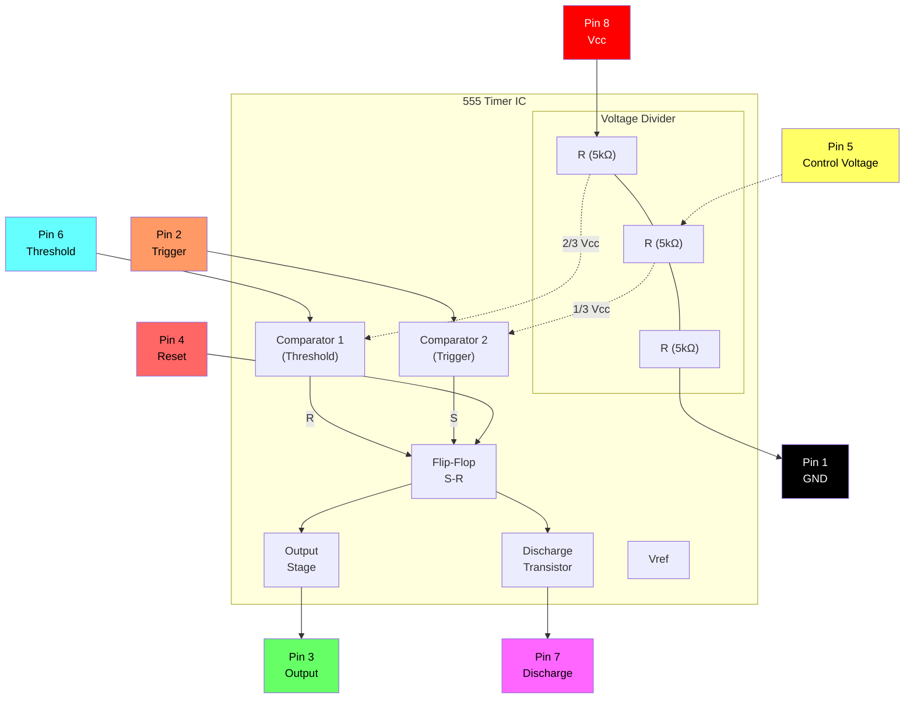

# Connecting Electronic Components

This guide provides step-by-step instructions for building electronic circuits on a breadboard. Each build progressively introduces new components and concepts.

---

## Basic Component Build Instructions

### Build 1 — Single LED

**Components:** Red LED, black jumper wire, red jumper wire, battery with holder

**Steps:**

1. Insert the black jumper wire into the breadboard from **A5** to **A14**.
2. Insert the red jumper wire into the breadboard from **J5** to **J14**.
3. Place the red LED into row 14 with the positive leg (the longer of the two legs) on the right side, aligned with the red wire, and the negative leg on the left, aligned with the black wire.
4. Insert the battery into its holder and place it in the breadboard, connecting negative to black and positive to red.

**Result:** When you insert the battery, the LED will light up.

**Troubleshooting:**

- Is your LED inserted backwards?
- Are the jumper wires in the same row as the LED leads?
- Are the jumper wires in the same row as the battery terminals?

---

### Build 2 — Single Push Button

**Components:** Red LED, push button, black jumper wire, red jumper wire, battery with holder

**Steps:**

1. Insert the black jumper wire into the breadboard from **A5** to **A16**.
2. Insert the red jumper wire into the breadboard from **J5** to **J12**.
3. Place the red LED into the breadboard with the positive leg (the longer of the two legs) inserted into **H15** and the negative leg into **G17**.
4. Place the push button horizontally in the middle of the breadboard so the bottom-left pin is on row 16 (aligned with the black jumper wire) and the top-right pin is on row 14 (aligned with the negative leg of the red LED).
5. Insert the battery into its holder and place it in the breadboard, connecting negative to black and positive to red.

**Result:** When you press the push button, the LED will light up.

**Troubleshooting:**

- Is your LED inserted backwards?
- Are the jumper wires in the same row as the LED leads?
- Are the jumper wires in the same row as the battery terminals?

---

### Build 3 — Photoresistor-Dimmed LED

**Components:** Green LED, photoresistor, black jumper wire, red jumper wire, battery with holder

**Steps:**

1. Insert the black jumper wire into the breadboard from **A5** to **A12**.
2. Insert the red jumper wire into the breadboard from **J5** to **J13**.
3. Place the green LED into the breadboard with the positive leg (the longer of the two legs) inserted into **F13** and the negative leg into **E13**.
4. Insert the photoresistor into the breadboard from **C12** to **D13**.
5. Insert the battery into its holder and place it in the breadboard, connecting negative to black and positive to red.

**Result:** When you insert the battery, the LED will light up. Covering the photoresistor will cause the LED to dim.

---

### Build 4 — Double LED Push Button

**Components:** Red LED, green LED, 220Ω resistor, push button, black jumper wire, red jumper wire, battery with holder

**Steps:**

1. Insert the black jumper wire into the breadboard from **A5** to **A11**.
2. Insert the red jumper wire into the breadboard from **J5** to **J11**.
3. Insert the 220Ω resistor into the breadboard from **I11** to **I15**.
4. Place the push button horizontally in the middle of the breadboard so the top pins are on row 15 and on opposite sides of the breadboard.
5. Place the red LED into the breadboard with the positive leg (the longer of the two legs) inserted into **C17** and the negative leg into **B11**.
6. Place the green LED into the breadboard with the positive leg inserted into **G15** and the negative leg into **E11**.
7. Insert the battery into its holder and place it in the breadboard, connecting negative to black and positive to red.

**Result:** When you insert the battery, the green LED will light up. When you press the push button, the green LED will turn off and the red LED will light up.

### Build 5 - Photoresistor Blinking LEDs

- Insert the black jumper wire into the breadboard from A3 to A12.
- Insert the red jumper wire into the breadboard from J3 to J12.
- Place the 555 integrated circuit chip into the middle of the breadboard with the top pins on row 12.
- Insert a jumper wire into the breadboard connecting D15 to G12.
- Insert a jumper wire into the breadboard connecting D13 to G14.
- Insert the 1000Ω resistor into the breadboard from C14 to H17.
- Insert the photoresistor into the breadboard from B14 to B15.
- Insert the capacitor into the breadboard from A13 to B12.
- Place the green LED into the breadboard with the positive leg (longer of the two legs) inserted into F17 and the negative leg into C12.
- Place the red LED into the breadboard with the positive leg inserted into I12 and the negative leg into J17.
- Insert the battery into its battery holder and place it in the breadboard, connecting negative to black and positive to red.

When you insert the battery, both LED’s will begin rapidly blinking. Covering the photoresistor from light will slow the LEDs blinking frequency.

---

## 555 Timer IC Reference

The 555 timer is a versatile integrated circuit used in timing, pulse generation, and oscillator applications. The following sections provide pinout information and internal circuit details.

### 555 Pinout Diagram

```
    ┌─────────────────────────────────────┐
    │  ●                                  │
    │  #1                             #8  │
    │  ┌──┐                         ┌──┐  │
    │  │  │                         │  │  │
    │  └──┘                         └──┘  │
    │  #2                             #7  │
    │  ┌──┐       555 TIMER         ┌──┐  │
    │  │  │                         │  │  │
    │  └──┘                         └──┘  │
    │  #3                             #6  │
    │  ┌──┐                         ┌──┐  │
    │  │  │                         │  │  │
    │  └──┘                         └──┘  │
    │  #4                             #5  │
    │  ┌──┐                         ┌──┐  │
    │  │  │                         │  │  │
    │  └──┘                         └──┘  │
    └─────────────────────────────────────┘
```

### 555 Pin Descriptions

| Pin | Symbol | Function |
|:---:|:---:|:---|
| 1 | GND | Ground reference (0V) |
| 2 | TRIG | Trigger input — starts timing cycle when voltage drops below ⅓ Vcc |
| 3 | OUT | Output — provides high or low signal |
| 4 | RESET | Reset input (active low) — forces output low when grounded |
| 5 | CONT | Control voltage — provides access to internal voltage divider (⅔ Vcc) |
| 6 | THRES | Threshold input — ends timing cycle when voltage exceeds ⅔ Vcc |
| 7 | DISCH | Discharge — open collector output for discharging timing capacitor |
| 8 | Vcc | Supply voltage (+4.5V to +16V) |

### 555 Internal Block Diagram



---

### Build 6 — Push Button Buzzer

**Components:** 555 timer IC, piezo speaker, 220Ω resistor, 1000Ω resistor, capacitor, push button, jumper wires, battery with holder

**Steps:**

1. Insert the black jumper wire into the breadboard from **A1** to **A11**.
2. Insert the red jumper wire into the breadboard from **J1** to **J11**.
3. Place the 555 integrated circuit chip into the middle of the breadboard with the top pins on row 11.
4. Insert a jumper wire into the breadboard connecting **D12** to **G13**.
5. Insert a jumper wire into the breadboard connecting **D14** to **G11**.
6. Insert the capacitor into the breadboard from **A12** to **B11**.
7. Insert the 220Ω resistor into the breadboard from **C12** to **C13**.
8. Place the push button horizontally in the middle of the breadboard so the top pins are on row 15 and on opposite sides of the breadboard.
9. Insert the piezo speaker into the breadboard with the positive pin in **A9** and the negative pin in **A6**.
10. Insert the 1000Ω resistor into the breadboard from **E6** to **A13**.
11. Insert a jumper wire into the breadboard connecting **C9** to **D15**.
12. Insert a jumper wire into the breadboard connecting **G17** to **I11**.
13. Insert the battery into its holder and place it in the breadboard, connecting negative to black and positive to red.

**Result:** When you press the push button, the buzzer will sound.

---

### Build 7 — Photoresistor Theremin

**Components:** 555 timer IC, piezo speaker, photoresistor, 1000Ω resistor, capacitor, push button, jumper wires, battery with holder

**Steps:**

1. Insert the black jumper wire into the breadboard from **A1** to **A11**.
2. Insert the red jumper wire into the breadboard from **J1** to **J11**.
3. Place the 555 integrated circuit chip into the middle of the breadboard with the top pins on row 11.
4. Insert a jumper wire into the breadboard connecting **D12** to **G13**.
5. Insert a jumper wire into the breadboard connecting **D14** to **G11**.
6. Insert the capacitor into the breadboard from **A12** to **B11**.
7. Insert the photoresistor into the breadboard from **C12** to **C13**.
8. Place the push button horizontally in the middle of the breadboard so the top pins are on row 15 and on opposite sides of the breadboard.
9. Insert the piezo speaker into the breadboard with the positive pin in **A9** and the negative pin in **A6**.
10. Insert the 1000Ω resistor into the breadboard from **E6** to **A13**.
11. Insert a jumper wire into the breadboard connecting **C9** to **D15**.
12. Insert a jumper wire into the breadboard connecting **G17** to **I11**.
13. Insert the battery into its holder and place it in the breadboard, connecting negative to black and positive to red.

**Result:** When you press the push button, the buzzer will sound. Covering the photoresistor will change the pitch of the buzzer.

---

### Build 8 — Potentiometer-Dimmed LED

**Components:** Green LED, potentiometer, 220Ω resistor, black jumper wire, red jumper wire, battery with holder

**Steps:**

1. Insert the black jumper wire into the breadboard from **A1** to **A13**.
2. Insert the red jumper wire into the breadboard from **J1** to **J9**.
3. Place the potentiometer with the two-pin side on the left, top pin in **E13** and bottom pin in **E15**.
4. Insert the 220Ω resistor into the breadboard from **H9** to **H14**.
5. Place the green LED into the breadboard with the positive leg (the longer of the two legs) inserted into **C15** and the negative leg in **B13**.
6. Insert the battery into its holder and place it in the breadboard, connecting negative to black and positive to red.

**Result:** When you insert the battery, the LED will turn on. Rotating the potentiometer will increase or decrease the brightness of the LED.

---

### Build 9 — Push Button RGB LED

**Components:** RGB LED (common cathode), three push buttons, two 220Ω resistors, black jumper wire, red jumper wire, jumper wires, battery with holder

**Steps:**

1. Insert the black jumper wire into the breadboard from **A1** to **B7**.
2. Insert the red jumper wire into the breadboard from **J1** to **J7**.
3. Insert the RGB LED into the breadboard from **A4** to **A8**. The longest of the four legs is the ground and should be in **A7**.
4. Place three push buttons horizontally in the middle of the breadboard with pins at:
   - Button 1: **E9–F9** and **E11–F11**
   - Button 2: **E12–F12** and **E14–F14**
   - Button 3: **E15–F15** and **E17–F17**
5. Insert a jumper wire into the breadboard connecting **C5** to **D9**.
6. Insert a jumper wire into the breadboard connecting **C6** to **C12**.
7. Insert a jumper wire into the breadboard connecting **B8** to **B15**.
8. Insert the first 220Ω resistor into the breadboard from **G7** to **G11**.
9. Insert the second 220Ω resistor into the breadboard from **H7** to **H14**.
10. Insert the battery into its holder and place it in the breadboard, connecting negative to black and positive to red.

**Result:** Pressing each push button will activate a different color channel of the RGB LED.

---

### Build 10 — Potentiometer-Controlled Buzzer

**Components:** 555 timer IC, piezo speaker, potentiometer, 220Ω resistor, capacitor, push button, jumper wires, battery with holder

**Steps:**

1. Insert the black jumper wire into the breadboard from **A1** to **A11**.
2. Insert the red jumper wire into the breadboard from **J1** to **J11**.
3. Place the 555 integrated circuit chip into the middle of the breadboard with the top pins on row 11.
4. Insert a jumper wire into the breadboard connecting **D12** to **G13**.
5. Insert a jumper wire into the breadboard connecting **D14** to **G11**.
6. Insert the capacitor into the breadboard from **A12** to **B11**.
7. Insert the piezo speaker into the breadboard from **A6** to **A9** (place the positive end on the bottom).
8. Place the push button horizontally in the middle of the breadboard so the top pins are in **E15** and **F15**.
9. Insert the 220Ω resistor into the breadboard from **E6** to **A13**.
10. Insert a jumper wire into the breadboard connecting **E9** to **D15**.
11. Insert a jumper wire into the breadboard connecting **G17** to **I11**.
12. Place the potentiometer with the two-pin side on the right, top pin in **F7** and bottom pin in **F9**.
13. Insert a jumper wire into the breadboard connecting **D8** to **B13**.
14. Insert a jumper wire into the breadboard connecting **H7** to **C12**.
15. Insert a jumper wire into the breadboard connecting **H9** to **D11**.
16. Insert the battery into its holder and place it in the breadboard, connecting negative to black and positive to red.

**Result:** Pressing the push button will cause the buzzer to sound. Rotating the potentiometer will alter the pitch of the buzzer.
