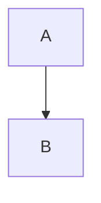

# Code Blocks to HTML

## Fenced Code Blocks (No Language)

### Markdown

```
function test() {
  console.log("notice the blank line before this function?");
}
```

### Parsed HTML

```html
<pre><code>
function test() {
  console.log("notice the blank line before this function?");
}
</code></pre>
```

---

## GitHub Tip Callout

### Markdown

```md
> [!TIP]
> To preserve your formatting within a list, make sure to indent non-fenced code blocks by eight spaces.
```

### Parsed HTML (GitHub-specific)

```html
<blockquote class="markdown-alert markdown-alert-tip">
  <p><strong>Tip</strong></p>
  <p>To preserve your formatting within a list, make sure to indent non-fenced code blocks by eight spaces.</p>
</blockquote>
```

---

## Showing Backticks Inside Code Blocks

### Markdown

`````md
    ````
    ```
    Look! You can see my backticks.
    ```
    ````
`````

### Parsed HTML

```html
    <pre><code>
    ```

    Look! You can see my backticks.

    ```
    </code></pre>
```

## Syntax Highlighting (Language Identifier)

### Markdown

```ruby
require 'redcarpet'
markdown = Redcarpet.new("Hello World!")
puts markdown.to_html
```

### Parsed HTML

```html
<pre><code class="language-ruby">
require 'redcarpet'
markdown = Redcarpet.new("Hello World!")
puts markdown.to_html
</code></pre>
```

> The `language-ruby` class is consumed by GitHub’s syntax highlighter (Linguist + grammar).

### Summary: Syntax-Highlighting Rules (HTML-Level)

| Markdown fence | Parsed `<code>` tag            |
| -------------- | ------------------------------ |
| ```js          | `<code class="language-js">`   |
| ```html        | `<code class="language-html">` |
| ```md          | `<code class="language-md">`   |
| ``` (no lang)  | `<code>`                       |

---

## HTML Comments (Ignored by Renderer)

```md
<!-- Internal documentation comment -->
```

```html
<!-- Internal documentation comment -->
```

---

## Links

```md
[About writing and formatting on GitHub](https://docs.github.com/...)
```

```html
<a href="https://docs.github.com/...">About writing and formatting on GitHub</a>
```

---

## Lists

```md
* [GitHub Flavored Markdown Spec](https://github.github.com/gfm/)
```

```html
<ul>
  <li>
    <a href="https://github.github.com/gfm/">GitHub Flavored Markdown Spec</a>
  </li>
</ul>
```

---

## Diagrams (Conceptual Parsing)

### Markdown

````md

````

### Parsed HTML

```html
<pre><code class="language-mermaid">
graph TD
  A --> B
</code></pre>
```

## Closing Notes

* No `language-*` class appears here because **no language identifier** was provided.
* The inner triple backticks are preserved **as literal text** inside `<code>`.
